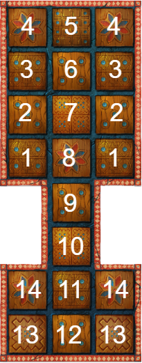

# 🐍Python environment for The Royal Game of Ur.

Here you can find a Python environment to run The Royal Game of Ur games. 

The main goal is to use this environment to train AI agents capable of playing the game at the best possible level using reinforcement learning techniques. 

In addition, this environment is capable of generating the logs for each game, which can be used to generate analytics and obtain insights from the game and also from the strategies adopted by the trained models.

## 👶How to get started
1. First of all you have to download or clone this repo information. You can do it by going **here**.
2. Create your own python script.
3. From your python script, import the module **environment.py** where the Python environment is stored.
4. Initialize a python environment by creating an instance of a Game class and setting the following configuration:
   
   ```python
   from environment import Game
   from agents.human_agent import Human
   from agents.random_agent import RandomAgent

   new_game = Game(player1=Human('Player1'), player2=RandomAgent(), print_board=True)
   ```

Feel free to play around with different configurations and using different Agents.

## 🎲Running simulations
To run a simulated play between two agents without manual intervention, you should create a Game instance using the desire Agents.

It is reccomended to save the log files into a specific folder for this matchup. For example, when simulating a matchup between two random Agents you could store the logs into the directory *'random_agent_vs_random_agent'*. The same for different Agents. Make sure you create the folder before starting the enviroment.

In the **simulation.py** file you can find an already setted simulation matchups to test. You should set the amount of simulations you would like to run for each matchup.

## 🗒️How logs and game state works
Logs are stored in **.csv** file format with "tab" delimiter instead of regular comma. They represent a dataset indicating for each game the game state and movements choosen by the players.

The logs variables definition is the following:
    
* game_id: A unique game identifier. It is set by the datetime stamp with miliseconds included. 
    ```python 
    datetime.datetime.now().strftime('%Y%m%d%H%M%S%f') -> 20220816160812345678.csv
    ```
* **turn_id**: Unique turn identifier.
* **turn**: Player name who plays in this turn. (Player name is define when creating the Agent instance)
* **token_color**: Token color for this player. ('light' or 'dark')
* **dice_roll_result**: Result of rolling the dice. (Int between 0 and 4)
* **light_token_1_position**: Position in the board for the light token 1.
* **light_token_2_position**: Position in the board for the light token 2.
* **light_token_3_position**: Position in the board for the light token 3.
* **light_token_4_position**: Position in the board for the light token 4.
* **light_token_5_position**: Position in the board for the light token 5.
* **light_token_6_position**: Position in the board for the light token 6.
* **light_token_7_position**: Position in the board for the light token 7.
* **dark_token_1_position**: Position in the board for the dark token 1.
* **dark_token_2_position**: Position in the board for the dark token 2.
* **dark_token_3_position**: Position in the board for the dark token 3.
* **dark_token_4_position**: Position in the board for the dark token 4.
* **dark_token_5_position**: Position in the board for the dark token 5.
* **dark_token_6_position**: Position in the board for the dark token 6.
* **dark_token_7_position**: Position in the board for the dark token 7.
* **decision**: Decision made by the player in this turn given all the previous information. The result is a tuple like (1,4) indicating the initial position of the token and the fila position of the token. As there can not be two tokens on the same tile, just by knowing the position of the token, we can identify which toke are we moving.

The last record in the log always should have one of the players with all the tokens at position 15 (the last one).

## 🎯How positions are set on the board
Here is the board with the position numbers.



Using 0 for tokens still not on the board and 15 for tokens in the goal.

As you can see, the numbers between 5 and 12 are the commons for both players. So each players can have a token in position 4 because is are different tiles, but there can only be one token among both players in position 6 for example.

This is a **valid** game state:
```
light_token_positions -> [1, 3, 5, 0, 0, 0, 0]
dark__token_positions -> [1, 3, 6, 0, 0, 0, 0]
```
This is an **invalid** game state:
```
light_token_positions -> [1, 3, 8, 0, 0, 0, 0]
dark__token_positions -> [1, 3, 8, 0, 0, 0, 0]
```

Feel free to play around!
